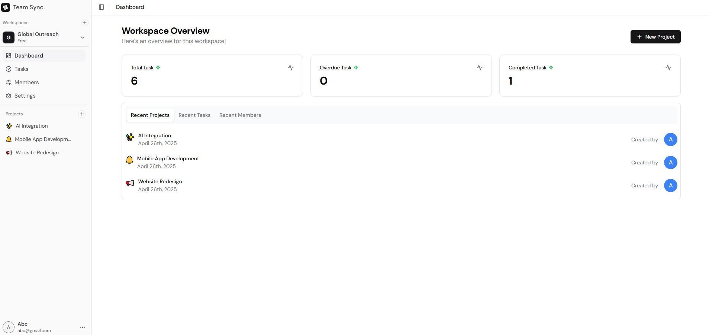
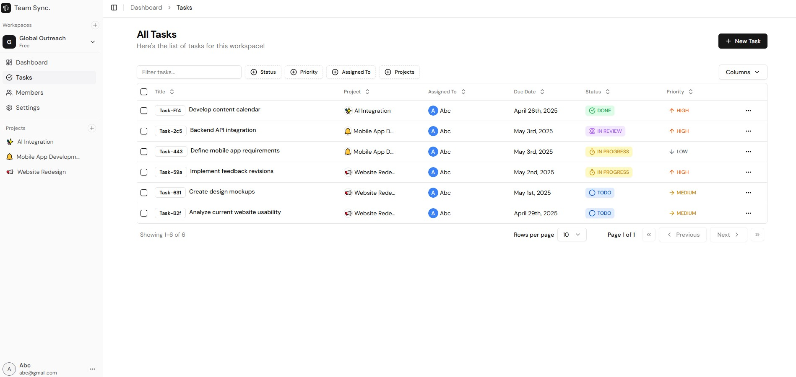
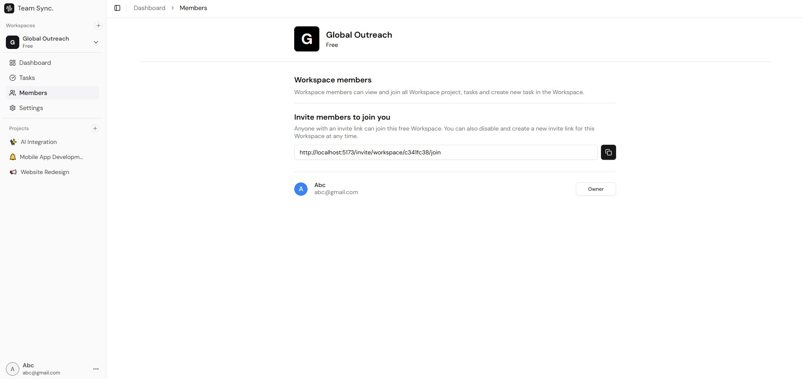
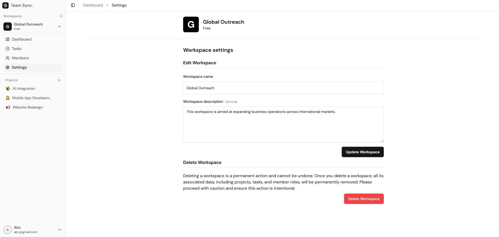

# 🚀 B2B Project Management System

<div align="center">
  
  
  
  
  
</div>

## 📋 Overview

A modern, scalable B2B Project Management System built with the MERN stack (MongoDB, Express.js, React, Node.js). This system helps businesses efficiently manage projects, tasks, and team collaboration.

## ✨ Key Features

- 🔐 Secure Authentication & Authorization
- 📊 Project Management Dashboard
- 📝 Task Management & Tracking
- 👥 Team Collaboration
- 📅 Project Timeline & Milestones
- 📈 Progress Tracking & Analytics
- 📱 Responsive Design

## 🛠️ Tech Stack

### Frontend
- React with TypeScript
- Tailwind CSS for styling
- Vite for fast development
- React Router for navigation
- Axios for API calls

### Backend
- Node.js with Express
- TypeScript
- MongoDB for database
- JWT for authentication
- RESTful API architecture

## 🚀 Getting Started

### Prerequisites
- Node.js (v14 or higher)
- MongoDB
- npm or yarn

### Installation

1. Clone the repository
```bash
git clone [your-repo-url]
```

2. Install dependencies
```bash
# Install backend dependencies
cd backend
npm install

# Install frontend dependencies
cd ../client
npm install
```

3. Set up environment variables
```bash
# Backend (.env)
PORT=8000
NODE_ENV=development

MONGO_URI="mongodb+srv://<username>:<password>@<>.mongodb.net/teamsync_db"

SESSION_SECRET="session_secret_key"
SESSION_EXPIRES_IN="1d"

GOOGLE_CLIENT_ID=
GOOGLE_CLIENT_SECRET=
GOOGLE_CALLBACK_URL=http://localhost:8000/api/auth/google/callback

FRONTEND_ORIGIN=http://localhost:5173
FRONTEND_GOOGLE_CALLBACK_URL=http://localhost:5173/google/oauth/callback

# Frontend (.env)
VITE_API_BASE_URL="http://localhost:8000/api"
```

4. Start the development servers
```bash
# Start backend server
cd backend
npm run dev

# Start frontend server
cd ../client
npm run dev
```

## 📸 Screenshots

### Dashboard


### Tasks Management


### Team Members


### Settings


## 🔧 Project Structure

```
├── client/                 # Frontend React application
│   ├── src/               # Source files
│   ├── public/            # Static files
│   └── package.json       # Frontend dependencies
│
└── backend/               # Backend Node.js application
    ├── src/              # Source files
    ├── models/           # Database models
    ├── routes/           # API routes
    └── package.json      # Backend dependencies
```


## 👨‍💻 Author

[Hamid Ali]

## 🔗 Links

- [Portfolio](your-portfolio-url)
- [LinkedIn](your-linkedin-url)
- [GitHub](https://github.com/HamidAli-Dev) 